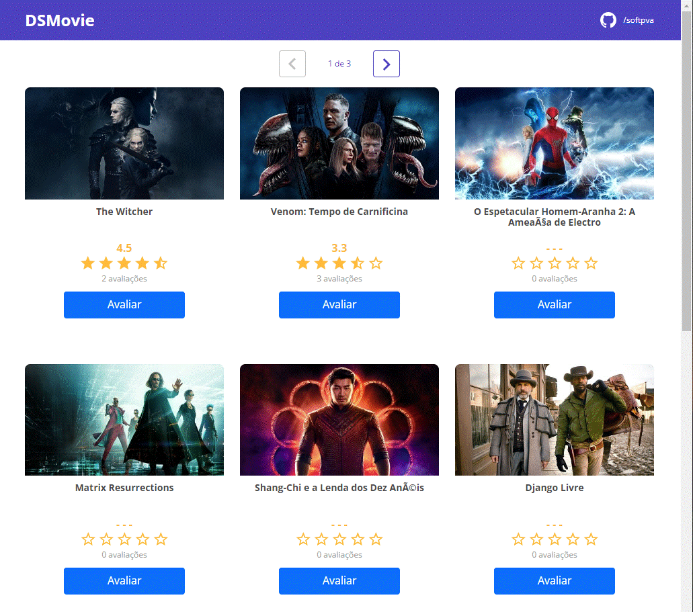
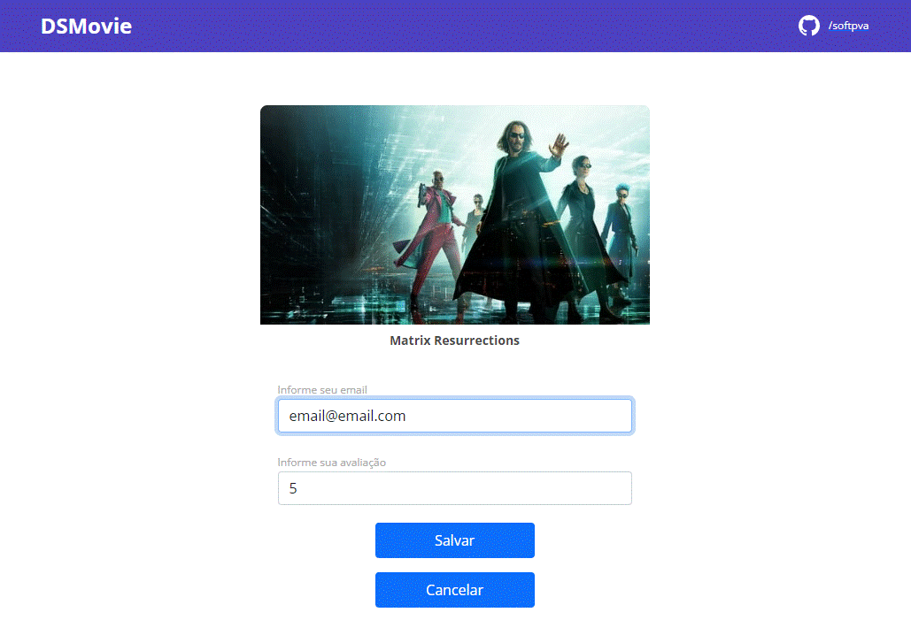
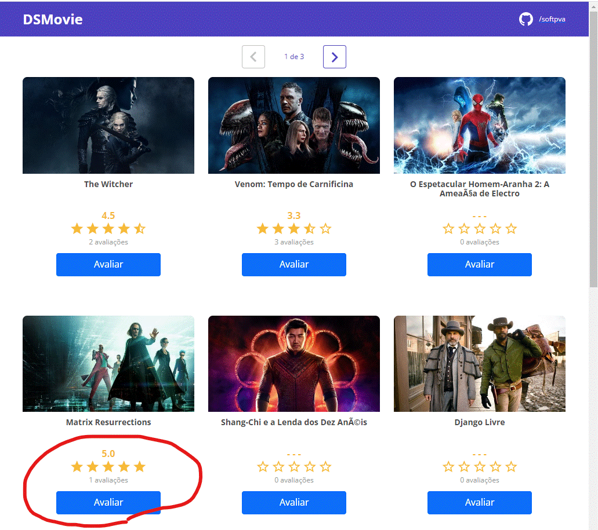
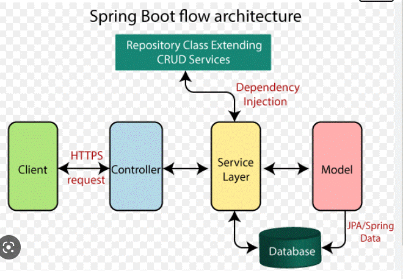

# **DSMovie**

# Acerca de
> DSMovie es una aplicación full stack desarrollada durante la semana Spring-React ofrecida por DevSuperior - Escola de Programação. (https://devsuperior.com.br/cursos)
>
> Esta aplicación obtiene un conjunto definido de películas, las muestra y permite al usuario calificar una película de su elección.
>
> [Basado en la semana Spring-React de DevSup](https://github.com/devsuperior/sds-dsmovie)
>
>  

# diseños
> ## Página de inicio
> 
>
> ## Después de hacer clic en un botón 'Avaliar'
> 
>
> ## Página de inicio después de calificar una de las películas con 5 estrellas.
> 

# Modelos
> ## Arquitectura Spring Boot
>   

> ## Modelo de base de datos
> 

# Tecnologias
> ## Back end
> - Java
> - H2 (dev)
> - PostgreSQL (deploy)
> - Spring Boot
>   - Spring Initializr dependencies:
>     - WEB
>     - JPA
>     - H2
>     - Postgres
>     - Security
> - JPA
> - Hibernate
> - Tomcat
> - Maven
>
> ## Front end
> - HTML5 (HTML,CSS,JS,TS)
> - Bootstrap
> - React (TS)
> - Yarn
> - Node

# Ejecutando la aplicación
> ## Back end
> Inicie Spring Boot (Spring, JPA, Hibernate, Tomcat (puerto: 8080 http)) mediante Maven:
> 
>        cd backend
>        ./mvnw spring-boot:run
> 
> Ou
>       
> 'Fat' jar:
>
>        cd backend
>        ./mvnw clean install
>        cd target
>        java -jar <artifact-name>.jar
> artifact-name = artifactId + version (em pom.xml)
>
> ## Front end
> Inicie node webpack en localhost:3000 mediante Yarn:
>
>        cd frontend
>        yarn start

# Coautor
> Pedro Vitor Abreu
>
> <soft.pva@gmail.com>
>
> <https://github.com/softpva>
>