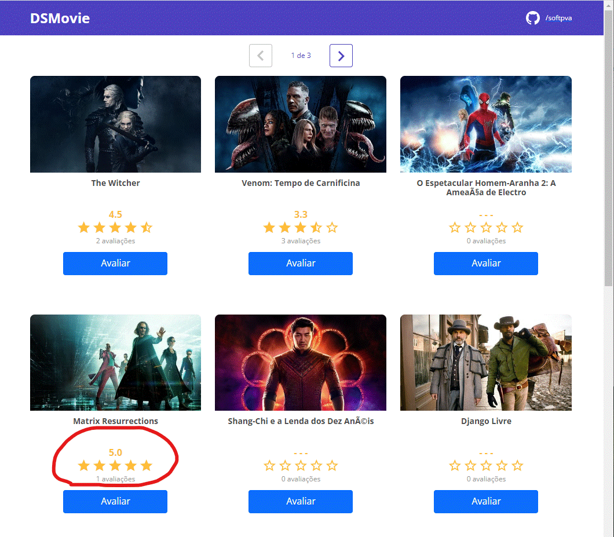

# **DSMovie**

  

# Sobre
> DSMovie é uma aplicação full stack desenvolvida durante a semana Spring-React oferecida por DevSuperior - Escola de Programação. (https://devsuperior.com.br/cursos)
>
> Esta aplicação busca um conjunto definido de filmes, mostra-os e permite que o usuário avalie um filme de sua escolha.
>
> [Baseado na semana Spring-React por DevSup ](https://github.com/devsuperior/sds-dsmovie)
>
>  

# Layouts
> ## Página Inicial
> 
>
> ## Após clicar em um botão avaliar
> 
>
> ## Página Inicial após avaliar com 5 estrelas um dos filmes.
> 

# Models
> ## Arquitetura Spring Boot
>   

> ## Modelo do banco de dados
> 

# Tecnologias
> ## Back end
> - Java
> - H2 (dev)
> - PostgreSQL (deploy)
> - Spring Boot
>   - Spring Initializr dependencies:
>     - WEB
>     - JPA
>     - H2
>     - Postgres
>     - Security
> - JPA
> - Hibernate
> - Tomcat
> - Maven
>
> ## Front end
> - HTML5 (HTML,CSS,JS,TS)
> - Bootstrap
> - React (TS)
> - Yarn
> - Node

# Rodando a aplicação
> ## Back end
> Iniciar Spring Boot (Spring,JPA,Hibernate,Tomcat(port: 8080 http)) via Maven:
> 
>        cd backend
>        ./mvnw spring-boot:run
> 
> Ou
>       
> 'Fat' jar:
>
>        cd backend
>        ./mvnw clean install
>        cd target
>        java -jar <artifact-name>.jar
> artifact-name = artifactId + version (em pom.xml)
>
> ## Front end
> Iniciar node webpack em localhost:3000 via Yarn:
>
>        cd frontend
>        yarn start

# Co-autor
> Pedro Vitor Abreu
>
> <soft.pva@gmail.com>
>
> <https://github.com/softpva>
>