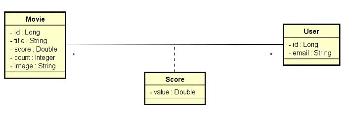

# **DSMovie**

  

# About
> DSMovie is a full stack app developed in Spring-React week by DevSuperior - Escola de Programação. (https://devsuperior.com.br/cursos)
>
> This application fetches a defined set of movies (by api and db), shows and allows the user to evaluate each chosen movie.
>
> [Based on Spring-React week studies by DevSup ](https://github.com/devsuperior/sds-dsmovie)
>
>  

# Features
> - 

# Layouts
> ## Layout 1
> First Page...

# Models
> ## Database model
> 

# Tecnologies
> ## Backend
> - Java
> - H2 (dev)
> - PostgreSQL (deploy)
> - Spring Boot
>   - Spring Initializr dependencies:
>     - WEB
>     - JPA
>     - H2
>     - Postgres
>     - Security
> - JPA
> - Hibernate
> - Tomcat
> - Maven
>
> ## Frontend
> - HTML5 (HTML,CSS,JS,TS)
> - Bootstrap
> - React (TS)
> - Yarn
> - Node

# Kick off
> ## Backend
> Launch Spring Boot (Spring,JPA,Hibernate,Tomcat(port: 8080 http)) by Maven:
> 
>        cd backend
>        ./mvnw spring-boot:run
>        
>
> ## Frontend
> Launch node webpack at localhost:3000 by Yarn:
>
>        cd frontend
>        yarn start

# Author
> Pedro Vitor Abreu
>
> <soft.pva@gmail.com>
>
> <https://github.com/softpva>
>

